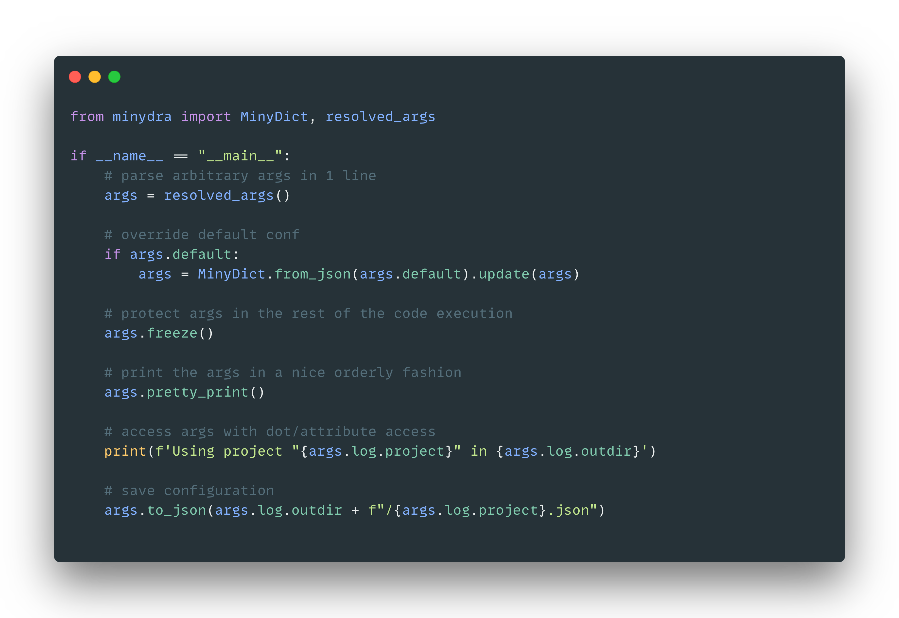

# minydra 🦎

Minimal Python command-line parser inspired by Facebook's Hydra + dot-accessible nested dictionaries.

Easily parse arbitrary arguments from the command line without dependencies:




```
pip install minydra
```

`minydra` is tested on Python `3.7`, `3.8` and `3.9`.

<p align="center">
 <a href="#getting-started"><strong>Getting Started</strong></a>&nbsp;•&nbsp;
 <a href="#forcing-types"><strong>Forcing types</strong></a>&nbsp;•&nbsp;
 <a href="#minydict"><strong>MinyDict</strong></a>&nbsp;•&nbsp;
 <a href="#strict-mode"><strong>Prevent typos</strong></a>
</p>

## Getting Started

[`examples/parser.py`](examples/parser.py)

```python
from minydra.parser import Parser

if __name__ == "__main__":
    parser = Parser(
        verbose=0, # print received args
        allow_overwrites=False, # allow repeating args in the command-line
        warn_overwrites=True, # warn repeating args if they are allowed
        parse_env=True, # get environment variable
        warn_env=True, # warn if an environment variable is specified but not found
    )
    args = parser.args.pretty_print().resolve().pretty_print() # notice .resolve() transforms dotted.keys into nested dicts
```

[`examples/resolved_args.py`](examples/resolved_args.py)

```python
from minydra import resolved_args

if __name__ == "__main__":
    args = resolved_args()
    args.pretty_print()
```

[`examples/demo.py`](examples/demo.py)
[`examples/demo.json`](examples/demo.json)

```python
from minydra import MinyDict, resolved_args
from pathlib import Path

if __name__ == "__main__":
    # parse arbitrary args in 1 line
    args = resolved_args()

    # override default conf
    if args.default:
        args = MinyDict.from_json(args.default).update(args)

    # protect args in the rest of the code execution
    args.freeze()

    # print the args in a nice orderly fashion
    args.pretty_print()

    # access args with dot/attribute access
    print(f'Using project "{args.log.project}" in {args.log.outdir}')

    # save configuration
    args.to_json(Path(args.log.outdir) / f"{args.log.project}.json")

```


[`examples/decorator.py`](examples/decorator.py)

```python
import minydra
from minydra.dict import MinyDict

@minydra.parse_args(verbose=0, allow_overwrites=False) # Parser's init args work here
def main(args: MinyDict) -> None:
    args.resolve().pretty_print()


if __name__ == "__main__":
    main()
```

## Parsing

* Simple strings are parsed to `float` and `int` automatically.
* A single keyword will be interpreted as a positive flag.
* A single keyword starting with `-` will be interpreted as a negative flag.
* If `parse_env` is `True`, environment variables are evaluated.

```
$ python decorator.py outdir=$HOME/project save -log learning_rate=1e-4 batch_size=64
╭───────────────────────────────────────────╮
│ batch_size    : 64                        │
│ learning_rate : 0.0001                    │
│ log           : False                     │
│ outdir        : /Users/victor/project     │
│ save          : True                      │
╰───────────────────────────────────────────╯
```

* dotted keys will be resolved to nested dictionary keys:

```
$ python examples/decorator.py server.conf.port=8000
╭────────────────────╮
│ server             │
│ │conf              │
│ │ │port : 8000     │
╰────────────────────╯
```

* Using `ast.literal_eval(value)`, `minydra` will try and parse more complex values for arguments as lists or dicts. Those should be specified as strings:

```
$ python examples/decorator.py layers="[1, 2, 3]" norms="{'conv': 'batch', 'epsilon': 1e-3}"
╭──────────────────────────────────────────────────╮
│ layers : [1, 2, 3]                               │
│ norms  : {'conv': 'batch', 'epsilon': 0.001}     │
╰──────────────────────────────────────────────────╯
```

### Forcing types

Adding `___<type>` to a key will force this type to the value. Notice how `01` is parsed to an integer `1` but `04` is parsed to a string (as specified) `"04"`, and `hello` is parsed to a `list`, not kept as a string

```
$ python examples/decorator.py n_jobs___str=04 job=01 chips___list=hello 
╭────────────────────────────────────────╮
│ chips  : ['h', 'e', 'l', 'l', 'o']     │
│ job    : 1                             │
│ n_jobs : 04                            │
╰────────────────────────────────────────╯
```

Known types are defined in `Parser.known_types` and the separator (`___`) in `Parser.type_separator`

```python
In [1]: from minydra import Parser

In [2]: Parser.known_types
Out[2]: {'bool', 'dict', 'float', 'int', 'list', 'set', 'str'}
```

## MinyDict

Minydra's args are a custom lightweight wrapper around native `dict` which allows for dot access (`args.key`), resolving dotted keys into nested dicts and pretty printing sorted keys in a box with nested dicts indented. If a key does not exist, it will not fail, rather return None (as `dict.get(key, None)`).

a `MinyDict` inherits from `dict` so usual methods work `.keys()`, `.items()` etc.

```python

In [1]: from minydra.dict import MinyDict

In [2]: args = MinyDict({"foo": "bar", "yes.no.maybe": "idontknow"}).pretty_print(); args
╭──────────────────────────────╮
│ foo          : bar           │
│ yes.no.maybe : idontknow     │
╰──────────────────────────────╯
Out[2]: {'foo': 'bar', 'yes.no.maybe': 'idontknow'}

In [3]: args.resolve().pretty_print(); args
╭──────────────────────────╮
│ foo : bar                │
│ yes                      │
│ │no                      │
│ │ │maybe : idontknow     │
╰──────────────────────────╯
Out[3]: {'foo': 'bar', 'yes': {'no': {'maybe': 'idontknow'}}}

In [4]: args.yes.no.maybe
Out[4]: "idontknow"

In [5]: "foo" in args
Out[5]: True

In [6]: "rick" in args
Out[6]: False

In [7]: args.morty is None
Out[7]: True

In [8]: args.items()
Out[8]: dict_items([('foo', 'bar'), ('yes', {'no': {'maybe': 'idontknow'}})])
```

### Dumping/Loading

You can save and read `MinyDict` to/from disk in two formats: `json` and `pickle`.

Both `to_pickle` and `to_json` have 3 arguments:

1. `file_path` as a `str` or `pathlib.Path` which is resolved:
    1. expand env variable (`$MYDIR` for instance)
    2. expand user (`~`)
    3. make absolute
2. `return_path` which defaults to `True`. If `True` `to_json` and `to_pickle` return the path of the created object
3. `allow_overwrites` which defaults to `True`. If `False` and `path` exists, a `FileExistsError` will be raised. Otherwise creates/overwrites the file at `file_path`
4. `verbose` which defaults to `0`. If `>0` prints the path of the created object

#### `json`

*Warning:* the `json` standard does not accept ints as keys in dictionaries so `{3: 2}` would be dumped -- and therefore loaded -- as `{"3": 2}`.

```python
In [1]: from minydra.dict import MinyDict

In [2]: args = MinyDict({"foo": "bar", "yes.no.maybe": "idontknow"}).resolve(); args
Out[2]: {'foo': 'bar', 'yes': {'no': {'maybe': 'idontknow'}}}

In [3]: args.to_json("./opts.json")

In [4]: args.to_json("./opts.json", verbose=1)
Json dumped to: /Users/victor/Documents/Github/vict0rsch/minydra/opts.json

In [5]: MinyDict.from_json("opts.json")
Out[5]: {'foo': 'bar', 'yes': {'no': {'maybe': 'idontknow'}}}
```

#### `pickle`

```python
In [1]: from minydra.dict import MinyDict

In [2]: args = MinyDict({"foo": "bar", "yes.no.maybe": "idontknow"}).resolve()

In [3]: print(args)
{'foo': 'bar', 'yes': {'no': {'maybe': 'idontknow'}}}

In [4]: assert args == MinyDict.from_pickle(args.to_pickle("opts.pkl"))
```

[`examples/dumps.py`](examples/dumps.py)

```
python examples/dumps.py path="./myargs.pkl" format=pickle cleanup

╭────────────────────────────╮
│ cleanup : True             │
│ format  : pickle           │
│ path    : ./myargs.pkl     │
╰────────────────────────────╯
Dumped args to /Users/victor/Documents/Github/vict0rsch/minydra/myargs.pkl
Cleaning up
```

### Strict Mode

To prevent typos from the command-line, `MinyDict.update` method has a strict mode: updating a `MinyDict` with another dictionary using `strict=True` will raise a `KeyError` if the key does not already exist:

```python
from minydra import MinyDict, resolved_args

if __name__ == "__main__":
    # parse arbitrary args in 1 line
    args = resolved_args()

    # override default conf
    if args.default:
        path = args.default
        # delete otherwise it will be used to update the conf which does not have
        # "default" as a key, therefore raising a KeyError in strict mode
        del args.default
        args = MinyDict.from_json(path).update(args, strict=True)

    args.pretty_print()
```

No typo:

```
$ python examples/strict.py default=./examples/demo.json log.logger.log_level=INFO
╭──────────────────────────────╮
│ log                          │
│ │logger                      │
│ │ │log_level   : INFO        │
│ │ │logger_name : minydra     │
│ │outdir  : /some/path        │
│ │project : demo              │
│ verbose : False              │
╰──────────────────────────────╯
```

Typo:

```
$ python examples/strict.py default=./examples/demo.json log.logger.log_leveel=INFO
Traceback (most recent call last):
  File "/Users/victor/Documents/Github/vict0rsch/minydra/examples/strict.py", line 13, in <module>
    args = MinyDict.from_json(path).update(args, strict=True)
  File "/Users/victor/Documents/Github/vict0rsch/minydra/minydra/dict.py", line 111, in update
    self[k].update(v, strict=strict)
  File "/Users/victor/Documents/Github/vict0rsch/minydra/minydra/dict.py", line 111, in update
    self[k].update(v, strict=strict)
  File "/Users/victor/Documents/Github/vict0rsch/minydra/minydra/dict.py", line 100, in update
    raise KeyError(
KeyError: 'Cannot create a non-existing key in strict mode ({"log_leveel":INFO}).'
```

#### `pretty_print`

Prints the `Minydict` in a box, with dicts properly indented. A few arguments:

1. `indents`, which defaults to `2`: the amount of indentation for nested dictionaries
2. `sort_keys`, which defaults to `True`: whether or not to alphabetically sort the keys before printing

#### `to_dict`

To produce a native Python `dict`, use `args.to_dict()`

### Protected attributes

`MinyDict`'s methods (including the `dict` class's) are protected, they are read-only and you cannot therefore set _attributes_ with there names, like `args.get = 2`. If you do need to have a `get` argument, you can access it through _items_: `args["get"] = 2`.

Try with [`examples/protected.py`](examples/parser.py):

```
python examples/protected.py server.conf.port=8000 get=3   
╭────────────────────╮
│ get    : 3         │
│ server             │
│ │conf              │
│ │ │port : 8000     │
╰────────────────────╯
<built-in method get of MinyDict object at 0x100ccd4a0>
3
dict_items([('get', 3), ('server', {'conf': {'port': 8000}})])
{'conf': {'port': 8000}}
```
