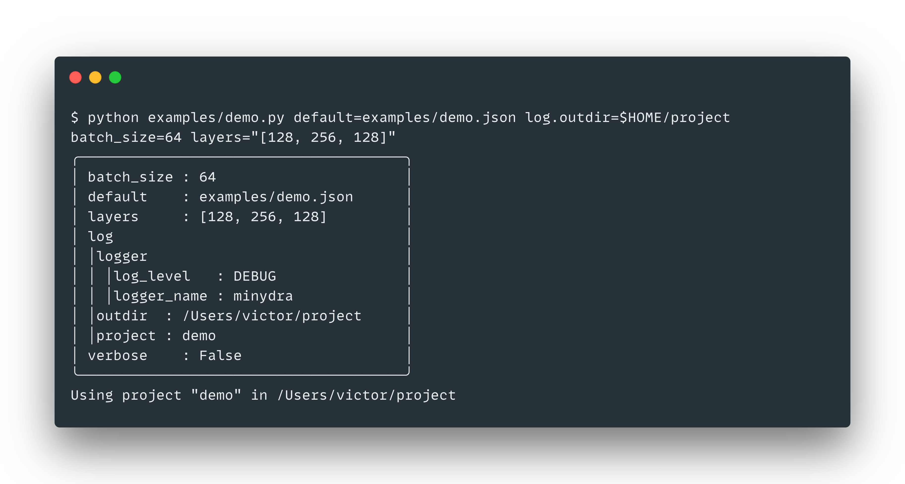

# minydra

Minimal Python command-line parser inspired by Facebook's Hydra.

Easily parse arbitrary arguments from the command line without dependencies:




## Usage:

[`examples/parser.py`](examples/parser.py)

```python
from minydra.parser import Parser

if __name__ == "__main__":
    parser = Parser(
        verbose=0, # print received args
        allow_overwrites=False, # allow repeating args in the command-line
        warn_overwrites=True, # warn repeating args if they are allowed
        parse_env=True, # get environment variable
        warn_env=True, # warn if an environment variable is specified but not found
    )
    args = parser.args.pretty_print().resolve().pretty_print() # notice .resolve() transforms dotted.keys into nested dicts
```

[`examples/decorator.py`](examples/decorator.py)

```python
import minydra
from minydra.dict import MinyDict

@minydra.parse_args(verbose=0, allow_overwrites=False) # Parser's init args work here
def main(args: MinyDict) -> None:
    args.resolve().pretty_print()


if __name__ == "__main__":
    main()
```

## Parsing

* Simple strings are parsed to `float` and `int` automatically.
* A single keyword will be interpreted as a positive flag.
* A single keyword starting with `-` will be interpreted as a negative flag.
* If `parse_env` is `True`, environment variables are evaluated.

```
$ python decorator.py outdir=$HOME/project save -log learning_rate=1e-4 batch_size=64

╭───────────────────────────────────────────╮
│ batch_size    : 64                        │
│ learning_rate : 0.0001                    │
│ log           : False                     │
│ outdir        : /Users/victor/project     │
│ save          : True                      │
╰───────────────────────────────────────────╯
```

* dotted keys will be resolved to nested dictionary keys:

```
$ python decorator.py server.conf.port=8000
╭─────────────────────────╮
│ server                  │
│     conf                │
│         port : 8000     │
╰─────────────────────────╯
```

* Using `ast.literal_eval(value)`, `minydra` will try and parse more complex values for arguments as lists or dicts. Those should be specified as strings:

```
$ python examples/decorator.py layers="[1, 2, 3]" norms="{'conv': 'batch', 'epsilon': 1e-3}"

╭──────────────────────────────────────────────────╮
│ layers : [1, 2, 3]                               │
│ norms  : {'conv': 'batch', 'epsilon': 0.001}     │
╰──────────────────────────────────────────────────╯
```

## MinyDict

Minydra's args are a custom lightweight wrapper around native `dict` which allows for dot access (`args.key`), resolving dotted keys into nested dicts and pretty printing sorted keys in a box with nested dicts indented.

a `MinyDict` inherits from `dict` so usual methods work `.keys()`, `.items()` etc.

```python

In [1]: from minydra.dict import MinyDict

In [2]: MinyDict({"foo": "bar", "yes.no.maybe": "idontknow"}).pretty_print()
╭──────────────────────────────╮
│ foo          : bar           │
│ yes.no.maybe : idontknow     │
╰──────────────────────────────╯

In [3]: MinyDict({"foo": "bar", "yes.no.maybe": "idontknow"}).resolve().pretty_print()
╭───────────────────────────────╮
│ foo : bar                     │
│ yes                           │
│     no                        │
│         maybe : idontknow     │
╰───────────────────────────────╯
```

